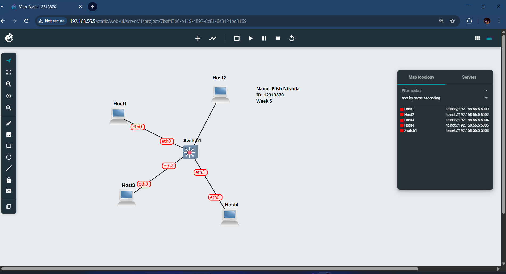
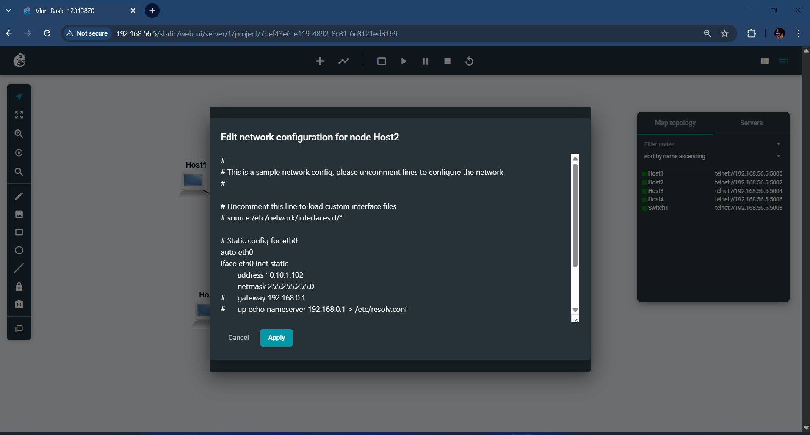
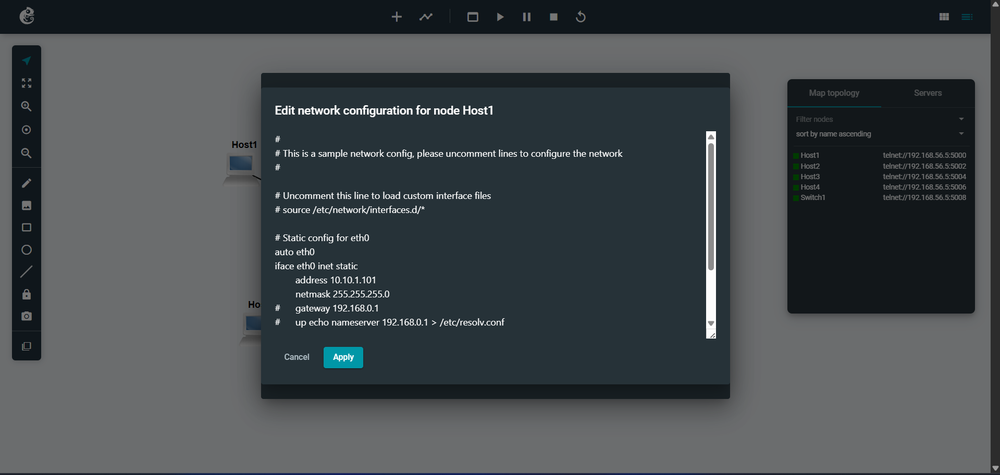
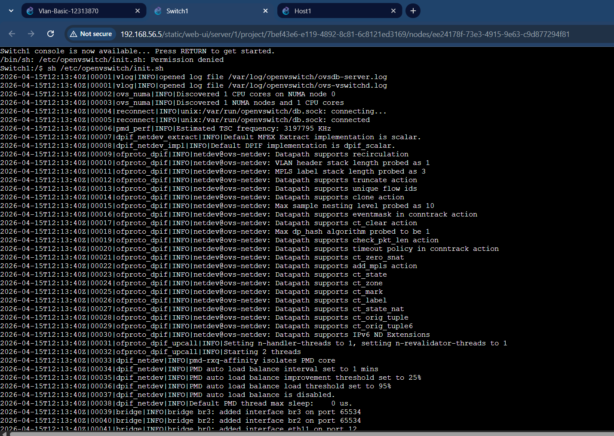
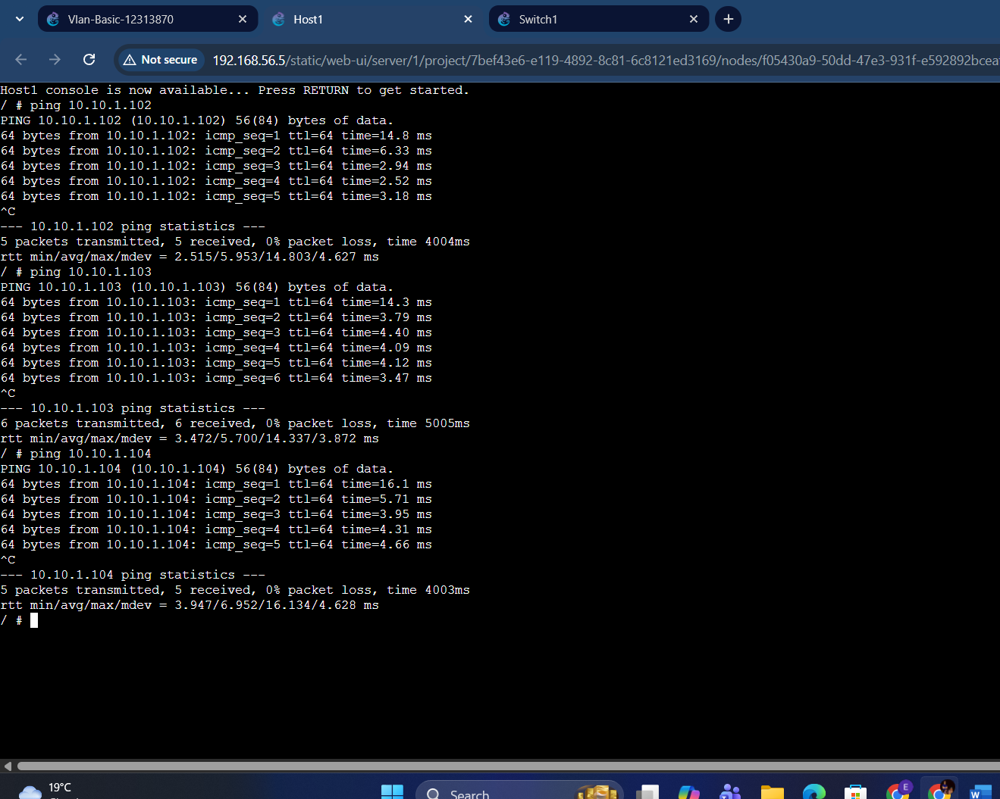
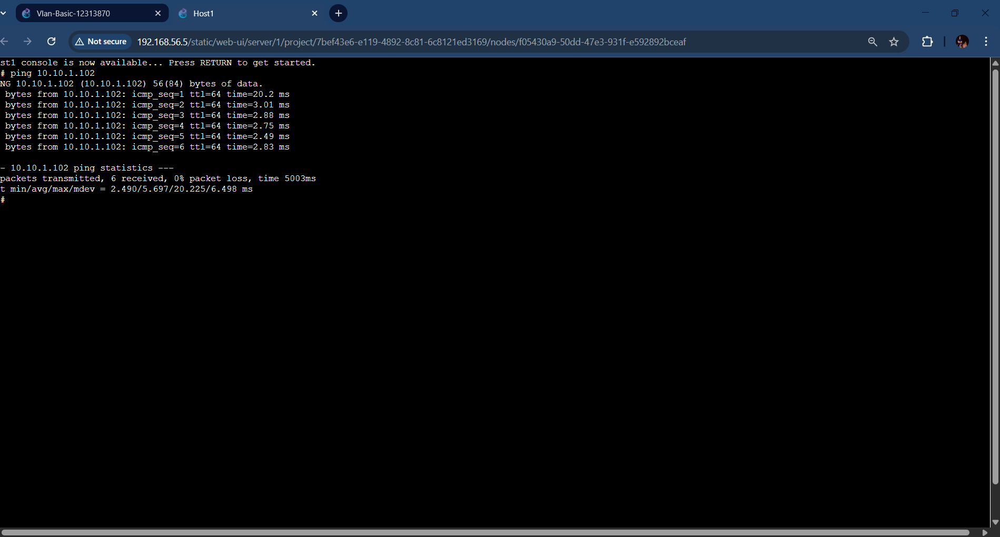
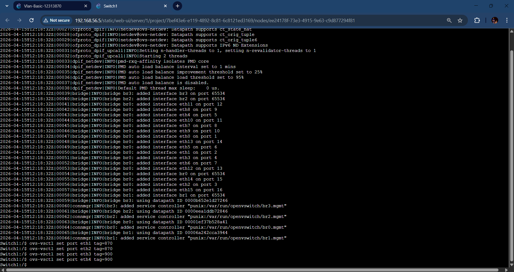
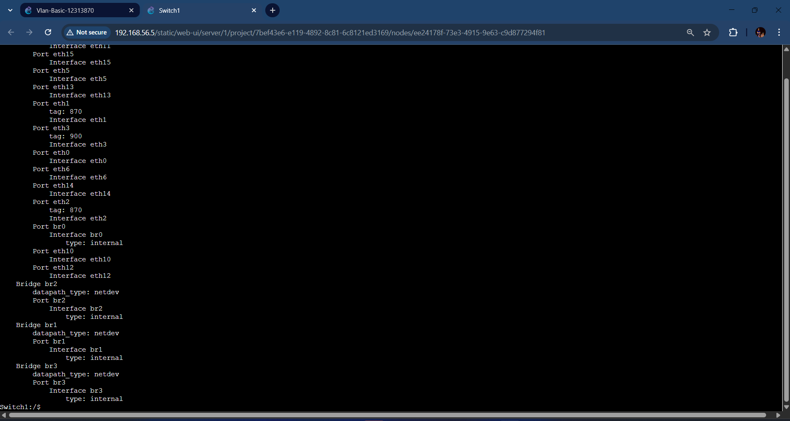
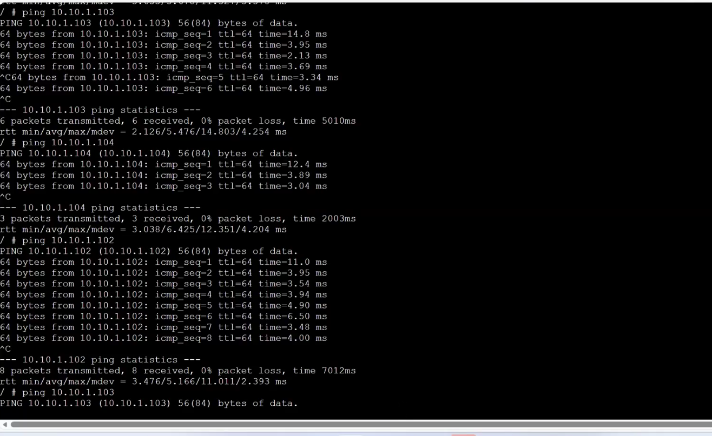
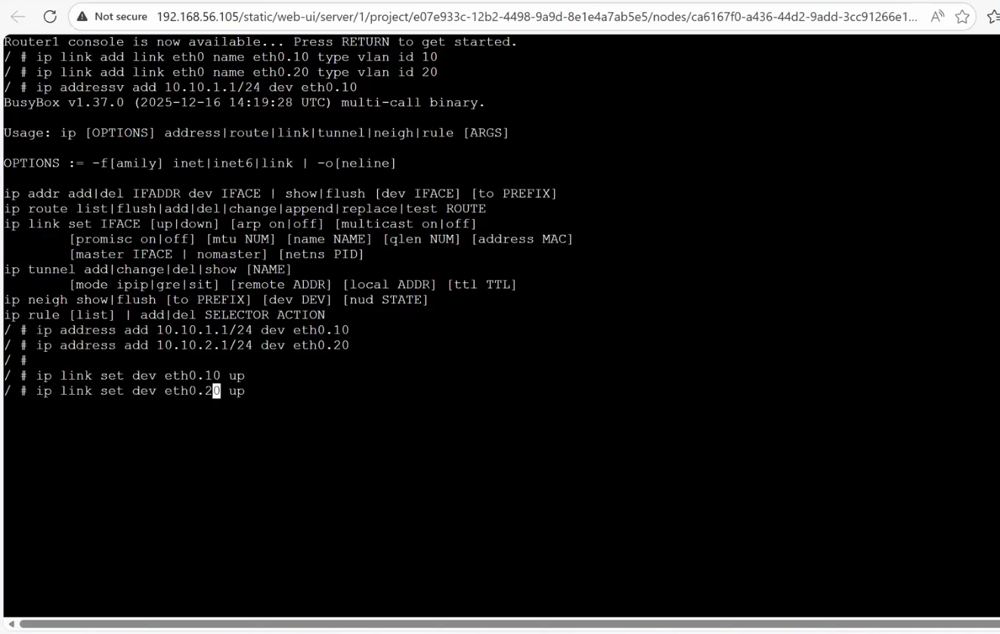

# COIT12206 TCP/IP Principles and Protocols  
## Week 5 Portfolio – VLAN Configuration  

### Student Details  
Name: Elish Niraula  
Student ID: 12313870  
Unit: COIT12206 TCP/IP Principles and Protocols  
Term: 2026 T1  

---

## Task 1: VLAN Configuration on Switch  

### Objective  
To understand how VLANs are configured on a managed switch and how network segmentation affects communication between hosts.

---

### Methodology  
A network topology was created in GNS3 consisting of four Linux hosts connected to an OpenvSwitch. All hosts were initially configured within the same subnet.  

VLANs were then configured on the switch by assigning different VLAN IDs to specific ports. Two hosts were placed in one VLAN, and the remaining two hosts were placed in another VLAN. Connectivity between hosts was tested before and after VLAN configuration.

---

### Commands Used  
ovs-vsctl show
ovs-vsctl set port eth1 tag=<VLAN-ID>
ovs-vsctl set port eth2 tag=<VLAN-ID>
ovs-vsctl set port eth3 tag=<VLAN-ID>
ovs-vsctl set port eth4 tag=<VLAN-ID>

---

### Results  
Before VLAN configuration, all hosts were able to communicate with each other. After assigning VLANs, communication was restricted to hosts within the same VLAN. Hosts in different VLANs were unable to communicate, demonstrating effective network segmentation.

---

### Screenshots  

### Screenshots  

---

## Task 2: VLAN Configuration with Router  

### Objective  
To configure VLANs on a router and enable communication between different VLANs using routing.

---

### Methodology  
The previous VLAN network was extended by adding a Linux router connected to the switch via a trunk port. VLANs were configured on the switch, and the trunk port was set to allow multiple VLANs.  

Sub-interfaces were created on the router for each VLAN, and IP addresses were assigned. This enabled routing between VLANs. Connectivity between hosts in different VLANs was tested.

---

### Commands Used  
ovs-vsctl set port eth0 trunks=[]
ip link add link eth0 name eth0.10 type vlan id 870
ip link add link eth0 name eth0.20 type vlan id 900
ip address add <ip>/<mask> dev eth0.870
ip address add <ip>/<mask> dev eth0.900

---

### Results  
After configuring the router and VLAN interfaces, hosts from different VLANs were able to communicate successfully. This demonstrates inter-VLAN routing and the role of routers in enabling communication across segmented networks.

---

### Screenshots  

---

## Conclusion  
The tasks demonstrated how VLANs segment a network and how routers enable communication between VLANs. VLANs improve network organisation and security, while routing ensures connectivity across different network segments.

---

## Reflection  
This week provided practical experience with VLAN configuration and routing. It enhanced my understanding of network segmentation and the importance of routers in managing communication between different network groups.
